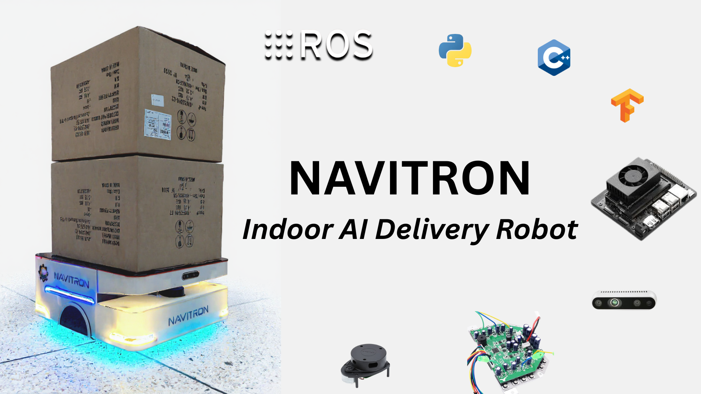

# Navitron: Indoor AI Delivery Robot

---



---


<div class="section-border">

## 1. Introduction

#### Navitron is an indoor autonomous delivery robot built with ROS, Jetson Nano, and advanced navigation frameworks. It combines hardware integration, AI-based navigation, and simulation-first development for practical robotics applications.

The project demonstrates real-world indoor delivery use cases such as restaurant service, office logistics, and smart home automation.

</div>

---

<div class="section-border">

## 2. What's special?

The **Navitron** isn't just another mobile robot a complete educational ecosystem designed to teach hardware integration, embedded programming, and AI/robotics concepts using **ROS 1 Melodic**. This platform bridges the gap between theory and practice by providing:

- Real-world hardware integration experience
- **ROS-based software architecture** understanding  
- Practical navigation and SLAM implementation
- Low-cost, accessible component selection


Before we dive into the build process, here's an overview of the Minibot's key subsystems:

1. **Processing Unit (Jetson Nano)**:
   - Runs ROS 1 Melodic master node
   - Handles high-level navigation algorithms
   - Processes LIDAR data for SLAM
   - Manages system coordination and visualization

2. **Motor Control Subsystem**:
   - Hoverboard for real-time motor control
   - Encoder feedback for precise odometry
   - rosserial communication with ROS

3. **Sensor Integration**:
   - LIDAR for navigation and obstacle detection
   - Encoders for dead reckoning
   - Battery monitoring for system health

4. **Navigation Stack**:
   - SLAM using gmapping
   - Path planning with move_base
   - Costmap-based obstacle avoidance
   - tf tree for coordinate transformations

</div>

---

### Key Features

#### Hardware Interface
- **ROS Control Integration**: Custom hardware interface for a differential drive robot
- **Arduino Communication**: rosserial-based communication with Arduino for motor control
- **Encoder Feedback**: Real-time encoder reading for odometry
- **Motor Control**: PWM-based motor control with smoothing and deadband

#### Navigation System
- **Move Base**: Complete navigation stack with global and local planning
- **Costmap Configuration**: Optimized costmaps for obstacle avoidance
- **Path Planning**: DWA local planner with configurable parameters
- **Localization**: AMCL for robot localization

#### Simulation Support
- **Gazebo Integration**: Full simulation environment with custom world
- **URDF Models**: Detailed robot description with 3D meshes
- **Map Support**: Pre-built maps for testing and development

</div>

---

<div class="section-border">

## 6. Bill of Materials (BOM)

### Core Hardware Components

| Component | Quantity | Purpose | Estimated Cost |
|-----------|----------|---------|----------------|
| **Jetson Nano** | 1 | Main processing unit for ROS 1 Melodic | $350 |
| **Arduino UNO** | 1 | Motor control and sensor interface | $6 |
| **L298N Motor Driver** | 1 | Drives two DC motors with current protection | $2 |
| **16x2 LCD Display** | 1 | System status and debugging information | $3 |
| **Encoder Motors (2x)** | 2 | DC motors with built-in encoders for odometry | $40 |
| **RPLIDAR A1M8** | 1 | 360° laser scanner for navigation | $99 |
| **Battery Pack (7.4V LiPo)** | 1 | Power supply for entire system | $30 |
| **Robot Chassis Kit** | 1 | Mechanical platform and wheels | $100 |
| **Jumper Wires & Connectors** | 1 set | Electrical connections | $3 |

**Total Estimated Cost: ~$633**

### Tools Required

- Soldering iron and solder
- Multimeter for electrical testing
- Screwdriver set
- Wire strippers
- Hot glue gun (optional)
- 3D printer access (optional, for custom mounts)

### Software Requirements

| Software | Version | Purpose |
|----------|---------|---------|
| **Ubuntu** | 18.04 LTS | Operating system for ROS 1 Melodic |
| **ROS 1** | Melodic | Robotic middleware framework |
| **Arduino IDE** | 1.8+ | Programming Arduino firmware |
| **Python** | 2.7| ROS node development |

</div>

---

<div class="section-border">

### Communication Architecture

The Minibot uses a distributed communication architecture:

1. **ROS Master Node** (Jetson Nano)
   - Coordinates all system components
   - Runs navigation algorithms
   - Processes sensor data

2. **Arduino Subsystem** (Microcontroller)
   - Real-time motor control
   - Encoder data acquisition
   - rosserial communication bridge

3. **Sensor Integration**
   - LIDAR data streaming
   - Odometry computation
   - System health monitoring

### Data Flow Diagram

```
                                                    ┌────────┐
                                                    │ LIDAR  │
                                                    └──┬─────┘
                                                       │
                                                       ▼
                                                  ┌────────────┐
                           ┌─────────────────────►│ ROS Topics │◄─────────────────┐
                           │                      └────┬───────┘                  │
                           │               ┌───────────┘                          │
                           │               ▼                                      │
                           │          ┌────────────┐     ┌─────────────┐          │
                           │          │  SLAM Node │────►│  Map Server │          │
                           │          └────┬───────┘     └────┬────────┘          │
                           │               │                  │                   │
                           │               ▼                  ▼                   │
                           │     ┌────────────┐         ┌────────────────┐        │
                           │     │Obstacle    │◄────────│ Local Costmap  │        │
                           │     │Detection   │         └────────────────┘        │
                           │     └────┬───────┘                                   │
                           │          │                                           │
                           │          ▼                                           │
                           │     ┌──────────────┐       ┌────────────────┐        │
                           │     │ Path Planner │──────►│ Global Planner │        │
                           │     └────┬─────────┘       └────┬───────────┘        │
                           │          │                      ▼                    │
                           │          ▼               ┌───────────────┐           │
                           │     ┌────────────┐       │Navigation Cmds│───────────┘
                           │     │   Arduino  │◄──────│   (cmd_vel)   │
                           │     └────┬───────┘       └───────────────┘
                           │          ▼
                           │     ┌─────────────┐
                           │     │ Motor Driver│
                           │     └────┬────────┘
                           │          ▼
                           │       ┌──────┐
                           │       │Wheels│
                           │       └──┬───┘
                           │          │
                           │          ▼
                           │     ┌─────────────┐
                           │     │  Encoders   │
                           │     └────┬────────┘
                           │          ▼
                           │     ┌─────────────┐
                           └─────│ Odometry    │
                                 └─────────────┘
```

---


# Power Distribution

Create a robust power distribution system:

1. **Main Power Bus**: 18V from LiPo battery
2. **5V Rail**: For Arduino, LCD, and logic circuits  
3. **12V Rail**: For motor driver 


**Power Budget Calculation:**
- Jetson Nano: ~10W (2A @ 5V)
- Arduino UNO: ~0.5W (100mA @ 5V)
- Motors: ~24W (2A @ 12V each)
- LIDAR: ~2.5W (500mA @ 5V)
- **Total: ~37W peak consumption**

# Component Integration

Install each major component with consideration for:

**Jetson Nano Placement:**
- Adequate ventilation for heat dissipation
- Access to GPIO pins for sensor connections
- USB ports for LIDAR and Arduino communication

**Hoverboard Positioning:**
- Close to motor driver for short signal paths
- Access to programming port
- Clear view of status LEDs

**LIDAR Mounting:**
- 360° unobstructed view
- Secure mounting to prevent vibration
- Appropriate height for navigation tasks

</div>

---


## 🙏 Thank You!

Thank you for exploring this project. I hope this educational mobile robot empowers you to dive deeper into robotics, hands-on learning, and real-world system integration. Your interest and dedication to building robots is what drives innovation in this field.

If you have **any suggestions, feedback, or improvements**, feel free to open an issue or reach out to me directly. Collaboration and learning go hand in hand, and I'd love to hear from you!

---

## 👤 About the Author

**Muhammad Saad**  
🎓 Mechatronics and Control Engineering Student  
🏫 University of Engineering and Technology, Lahore  
📍 Lahore, Pakistan  
📧 Email: [msaadmceu@gmail.com](mailto:msaadmceu@gmail.com)


